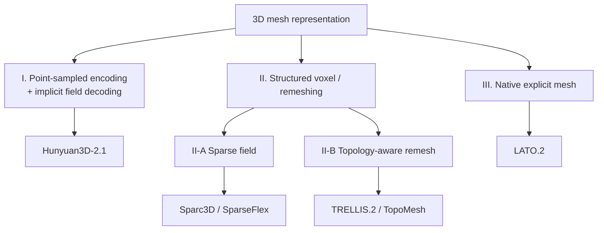
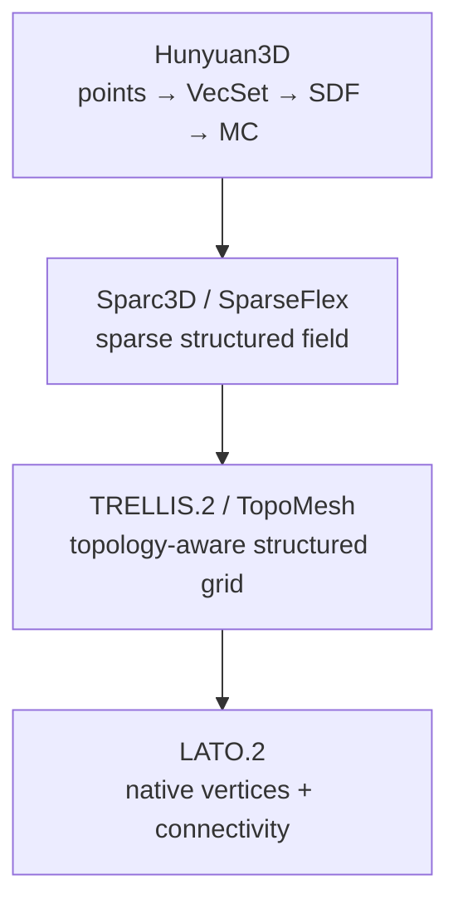

*潜空间 3D Mesh Generation*

This note is about **latent 3D generation**, not earlier mesh pipelines. SDS / score-distillation, GAN-based 3D, and direct image-to-mesh regression do not share the same loop. The methods below first compress a 3D representation into a latent, then generate that latent with DiT or flow matching:

**Image → 3D latent → VAE decoder → mesh.**

The remaining design choice is: *what 3D representation should that latent encode?* I compare six recent methods through **represent, compress, generate**. The story is a shift from generating a field and extracting a mesh, toward modeling mesh topology more directly.



## 1. Introduction

A typical high-fidelity latent pipeline is not a single generator. It is a **3D autoencoder** plus a **latent generator** (DiT / flow matching / diffusion). Comparing papers by year or by “image-to-3D vs text-to-3D” hides the real difference: **Stage 1**, the representation inside that latent.

This note compares Hunyuan3D-2.1, Sparc3D, SparseFlex, TRELLIS.2 / O-Voxel, TopoMesh, and LATO.2. Hunyuan is **not** a point-cloud generator. Surface points are only the encoder input; the decoded 3D object is still an implicit SDF, converted to a mesh by Marching Cubes.

## 2. A Unified Three-Stage Framework

### 2.1 Stage 1 — Define the 3D representation

The mesh must be turned into something a network can learn: surface samples, SDF, sparse voxels, dual-grid topology, or native vertices and connectivity.

### 2.2 Stage 2 — Train a 3D autoencoder / VAE

```text
3D representation → encoder → latent z → decoder → representation / mesh
```

The goal is high compression with high geometric fidelity. The VAE’s reconstruction quality is an upper bound on generation quality.

### 2.3 Stage 3 — Train a latent generation model

```text
Image → image encoder → Diffusion / Flow / DiT → latent → VAE decoder → mesh
```

**DiT** is an architecture. **Flow matching / rectified flow** is the training objective. They are often combined, not alternatives.

## 3. Point-Sampled Encoding and Implicit Field Decoding

### 3.1 Hunyuan3D-2.1

[Paper](https://arxiv.org/abs/2506.15442) · [Code](https://github.com/Tencent-Hunyuan/Hunyuan3D-2.1)

**Stage 1.** GT mesh → surface points + normals.

**Stage 2.** Points + normals → ShapeVAE → VecSet latent → SDF decoder → Marching Cubes.

**Stage 3.** Image → DINOv2 → flow-matching DiT → VecSet → ShapeVAE decoder → SDF → MC → mesh.

**Pros.** Strong global shape prior; simple latent generation; mature implicit representation.

**Cons.** Topology is not modeled directly; sharp detail depends on SDF resolution; isosurface extraction is required.

This is **Category I**: point-sampled *encoding*, implicit-field *decoding*.

## 4. Structured Sparse Field Representations

Here the mesh is first converted into a **structured voxel field**, then compressed by a VAE.

### 4.1 Sparc3D

[Paper](https://arxiv.org/abs/2505.14521) · [Project](https://lizhihao6.github.io/Sparc3D/) · [Code](https://github.com/lizhihao6/Sparc3D)

Sparcubes = active cubes + SDF + deformation. The main claim is a **modality-consistent sparse VAE** (Sparconv-VAE): sparse convs in, sparse fields out, aiming at near-lossless reconstruction at high resolution (e.g. \(1024^3\)).

**Pipeline.** Mesh → active cubes → SDF + deformation → VAE → SDF + deformation → surface extraction → mesh.

### 4.2 SparseFlex

[Paper](https://arxiv.org/abs/2503.21732) · [Project](https://xianglonghe.github.io/TripoSF/) · [Code](https://github.com/VAST-AI-Research/TripoSF)

Sparse voxels + SDF + deformation + **FlexiCubes** parameters, with **differentiable** surface extraction and a rectified-flow transformer for generation.

**Pipeline.** Mesh → sparse voxels → SDF + deformation + FlexiCubes params → VAE → DMC / FlexiCubes → mesh.

Together, Hunyuan’s *continuous* implicit field becomes a *structured sparse field*: geometry is already indexed by voxels.

## 5. Structured Remeshing and Topology-Aware Representations

The next step is not only a field on voxels, but a **grid-aligned mesh topology** that the VAE can learn.

### 5.1 TRELLIS.2 / O-Voxel

[Paper](https://arxiv.org/abs/2512.14692) · [Project](https://microsoft.github.io/TRELLIS.2/) · [Code](https://github.com/microsoft/TRELLIS.2)

O-Voxel is a **field-free** sparse structure: active voxels, dual vertices, edge crossings, and splitting. Topology comes from edge-crossing information, not from SDF sign. A Sparse Compression VAE maps O-Voxels to a compact structured latent; a large flow-matching model generates that latent.

**Pipeline.** Original mesh → O-Voxel remesh → sparse VAE → O-Voxel → mesh.

### 5.2 TopoMesh

[Paper](https://arxiv.org/abs/2603.24278) · [Project](https://logan0601.github.io/projects/topomesh/index.html) · Code: not released (as of this writing)

TopoMesh’s emphasis is **topological unification**. Arbitrary meshes are converted by Topo-Remesh into a DMC-compliant GT mesh. Topo-VAE predicts a DMC-compatible mesh in the same topology family, so vertex-to-vertex, face-to-face, and orientation losses become well-defined.

**Pipeline.** Original mesh → Topo-Remesh → DMC-compliant GT → Topo-VAE → DMC mesh.

### 5.3 TRELLIS.2 vs TopoMesh

Both **remesh first, then learn a latent**. They differ in what that remesh is for.

| | TRELLIS.2 | TopoMesh |
| --- | --- | --- |
| GT conversion | O-Voxel | DMC remesh |
| Field | Field-free | Occupancy / SDF-assisted |
| Topology | Edge-crossing flags | DMC occupancy |
| Vertex | Dual vertex | Dual vertex |
| Main goal | Representation | Topology-aligned supervision |
| Mesh type | Complex / open topology | Watertight DMC mesh |

## 6. Native Explicit Mesh Modeling without Remeshing

### 6.1 LATO.2

[Paper](https://arxiv.org/abs/2607.10623) · [Code](https://github.com/LoHhhha/LATO.2)

Previous methods convert the original mesh into a new representation, then train a VAE on that. LATO.2 keeps original vertices and connectivity.

- **Vertices.** VDF (surface point + normal + displacement to triangle vertices) → V-VAE.
- **Connectivity.** Original adjacency → T-VAE.
- **Generation.** V-Flow → vertices; T-Flow → connectivity; then an explicit mesh.

This is **Category III**: native explicit mesh / direct vertex-and-topology generation. It is the most “mesh-like” route, and currently the least stable.

## 7. Remeshing vs Native Mesh Generation

**Route A — structured remeshing** (Sparc3D, TRELLIS.2, TopoMesh): constrain topology first, then learn geometry.

- *Pros:* more stable connectivity, fewer topology failures, easier high-fidelity reconstruction.
- *Cons:* original topology is changed; the grid still constrains the representation.

**Route B — native explicit mesh** (LATO.2): learn vertices and connectivity directly.

- *Pros:* no remeshing, native mesh, flexible and editable connectivity.
- *Cons:* connectivity is hard; holes, wrong edges, orientation errors, and surface instability.

**Our empirical observation (not a claim from the LATO.2 paper).** In our own tests, LATO.2 often showed holes, inconsistent face orientation, and rough triangles. Direct connectivity generation is attractive, but topology errors remain the bottleneck.

## 8. Evolution of 3D Representations



The field is moving from indirect surfaces toward explicit, topology-aware meshes. The trade-off is consistent: **more explicit means more topological freedom and a harder learning problem.**

| Implicit field | Dual-grid / remeshed mesh | Native connectivity |
| --- | --- | --- |
| Stable topology, less explicit control | Balanced | Maximum freedom, lowest current stability |

## 9. Discussion and Future Directions

**Geometry fidelity vs topology flexibility.** TopoMesh / O-Voxel are currently more stable. LATO.2 is more free.

**High-resolution industrial geometry.** Sharp edges, small holes, thin parts, and mechanical structure still favor structured representations.

**Multi-view / RGB-D conditioning** is orthogonal to representation:

```text
Multi-view RGB / RGB-D → fusion encoder → 3D latent generation → TopoMesh / O-Voxel / other decoder
```

**Native mesh generation is promising but immature.** Direct connectivity generation is conceptually right; topology errors are still the main failure mode.

## 10. Conclusion

Three generations are visible:

1. **Implicit-field latent** — Hunyuan3D.
2. **Structured / remeshed latent** — Sparc3D, SparseFlex, TRELLIS.2, TopoMesh.
3. **Native explicit-mesh latent** — LATO.2.

Structured remeshing currently balances geometric fidelity and topology stability. Native explicit-mesh generation is more flexible, and still a challenging future direction.

## Paper summary

| Method | Category | Stage 1 | Stage 2 | Stage 3 | Paper | Code |
| --- | --- | --- | --- | --- | --- | --- |
| Hunyuan3D-2.1 | I. Implicit SDF | Surface points + normals | ShapeVAE → VecSet → SDF | Flow-matching DiT | [arXiv](https://arxiv.org/abs/2506.15442) | [GitHub](https://github.com/Tencent-Hunyuan/Hunyuan3D-2.1) |
| Sparc3D | II-A. Sparse field | Sparcubes: SDF + deformation | Sparconv-VAE | Latent diffusion | [arXiv](https://arxiv.org/abs/2505.14521) | [GitHub](https://github.com/lizhihao6/Sparc3D) |
| SparseFlex | II-A. Sparse field | Sparse voxels + FlexiCubes | Sparse VAE | Rectified flow | [arXiv](https://arxiv.org/abs/2503.21732) | [GitHub](https://github.com/VAST-AI-Research/TripoSF) |
| TRELLIS.2 | II-B. Topology remesh | O-Voxel (field-free) | Sparse Compression VAE | Flow matching (4B) | [arXiv](https://arxiv.org/abs/2512.14692) | [GitHub](https://github.com/microsoft/TRELLIS.2) |
| TopoMesh | II-B. Topology remesh | Topo-Remesh → DMC mesh | Topo-VAE | Latent generator (paper demos generation) | [arXiv](https://arxiv.org/abs/2603.24278) | Not released |
| LATO.2 | III. Native mesh | Original vertices + connectivity | V-VAE + T-VAE | V-Flow + T-Flow | [arXiv](https://arxiv.org/abs/2607.10623) | [GitHub](https://github.com/LoHhhha/LATO.2) |
